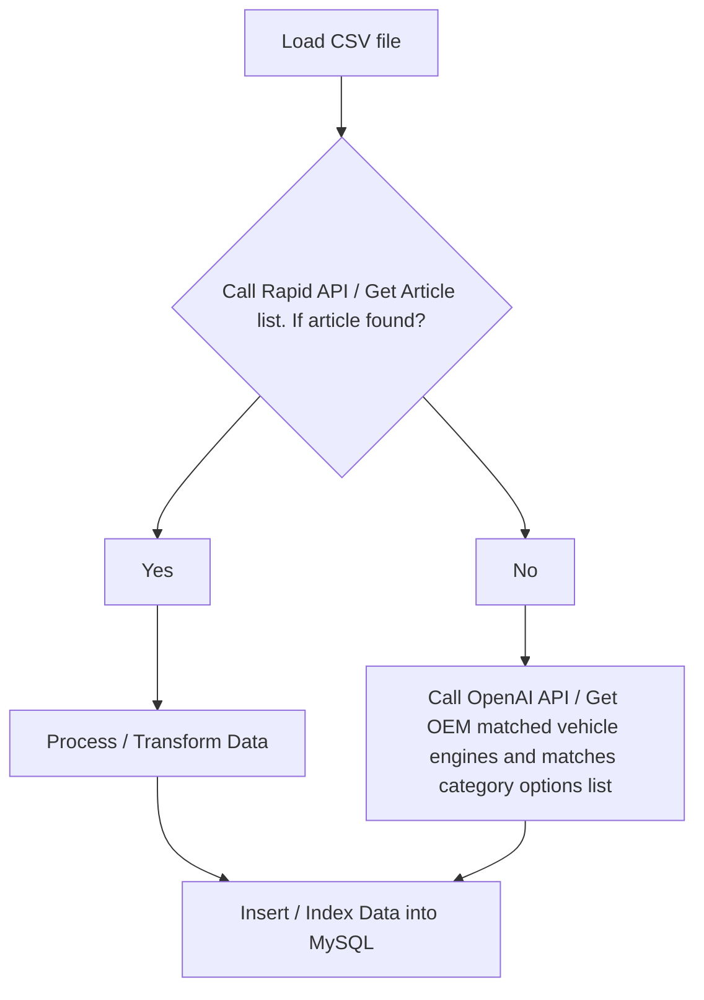

# RadidAPI + OpenAI + MySQL Data Flow (ETL Pipeline)

---

## Architecture Diagram

```mermaid
flowchart TD
    A[Load CSV file] --> B{Call Rapid API / Get Article list. If article found?}
    B --> Yes --> C[Process / Transform Data]
    B --> No --> D[Call OpenAI API / Get OEM matched vehicle engines and matches category options list]
    C --> E[Insert / Index Data into MySQL]
    D --> E[Insert / Index Data into MySQL]
```